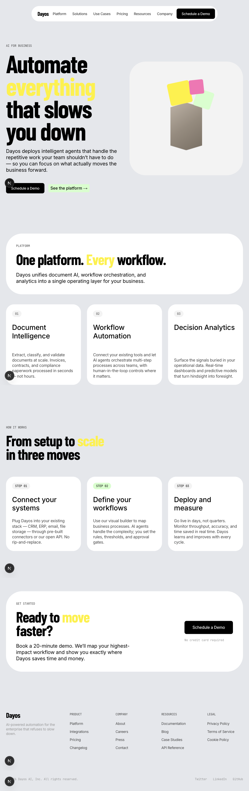

# Dayos — AI for Business

Swiss-editorial visual system for an AI-powered business platform. Built with Next.js and Tailwind CSS.



## Design System

The page behaves like a print spread — one colossal typographic statement per section, set tight with generous whitespace rather than dividers or rules. Color is nearly absent in chrome and nearly explosive in 3D illustration.

### Color Tokens

| Name | Value | Role |
|------|-------|------|
| Canvas Mist | `#e5e7eb` | Page background, section canvases, hairline dividers |
| Pure White | `#ffffff` | Card surfaces, navigation pill, elevated panels |
| Surface Mist | `#f3f3f3` | Secondary surfaces, button hover washes |
| Ink Black | `#000000` | Primary headings, body text, icon fills |
| Steel Gray | `#979797` | Secondary body text, captions, muted link text |
| Graphite | `#444444` | Navigation text, secondary borders |
| Mint Pulse | `#d1ffca` | Highlight wash behind emphasized links or selected tags |
| Electric Yellow | `#fff100` | Inline text emphasis, marker highlights, hero illustration |

### Typography

| Face | Substitute | Role |
|------|-----------|------|
| **SuisseIntl** | Inter | Primary UI and body face — nav links, buttons, body copy |
| **SuisseIntlCond** | Barlow Condensed Bold | Display headline face for hero and section statements |
| **SuisseIntlMono** | JetBrains Mono | Mono micro-voice for tags, category labels, inline markers |

### Surface Stack

```
Level 1  Canvas        #e5e7eb   Page and section ground
Level 2  Card          #ffffff   Cards, nav pill, elevated content blocks
Level 3  Subtle        #f3f3f3   Secondary wash for buttons, hovered rows
Level 4  Accent Wash   #d1ffca   Mint highlight behind emphasized links
Level 5  Accent Loud   #fff100   Yellow marker surface for spotlight moments
```

## Getting Started

```bash
npm install
npm run dev
```

Open [http://localhost:3000](http://localhost:3000) in your browser.

## Project Structure

```
src/
├── app/
│   ├── globals.css      # Design tokens, typography helpers, component primitives
│   ├── layout.tsx       # Root layout, font loading, metadata
│   └── page.tsx         # Page composition
└── components/
    ├── Navigation.tsx   # White pill nav bar
    ├── Hero.tsx         # Display headline + animated 3D illustration
    ├── Features.tsx     # Platform capabilities cards
    ├── HowItWorks.tsx   # Three-step process section
    ├── CTA.tsx          # Conversion call-to-action
    └── Footer.tsx       # Link columns and brand
```

## Key Design Decisions

- **No shadows, no gradients** — surfaces are flat; separation comes from white-on-gray contrast
- **5-level tonal stack** — canvas → white → mist → mint → yellow, no new neutrals introduced
- **Display headlines** — Barlow Condensed 700 at 48–130px, line-height 0.90, letter-spacing -3%
- **Animations** — hero cubes drift in on load, then float on independent sine-wave cycles
- **Max width** — 1280px page container, 80px section gaps

## Tech Stack

- [Next.js 16](https://nextjs.org) (App Router, Turbopack)
- [TypeScript](https://www.typescriptlang.org)
- [Tailwind CSS 4](https://tailwindcss.com)
- Google Fonts: Inter, Barlow Condensed, JetBrains Mono
